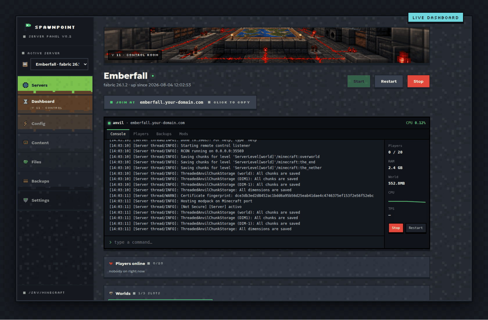
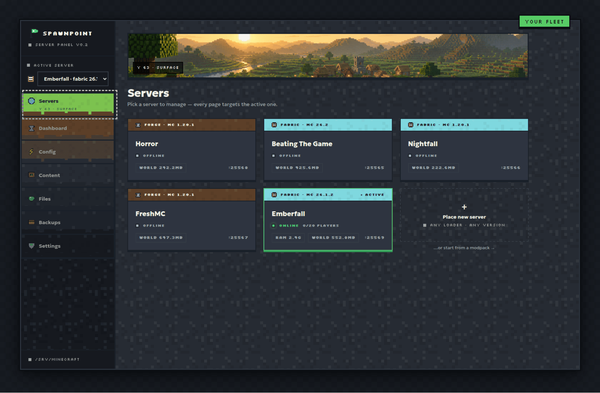
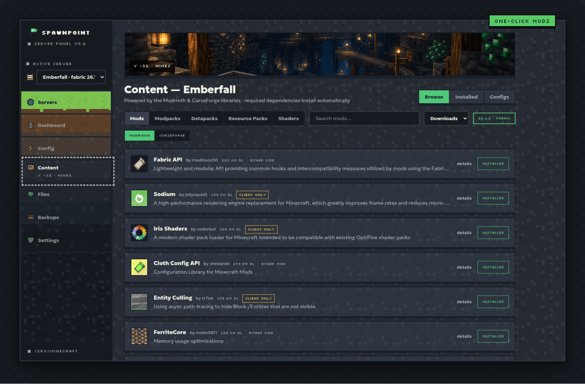
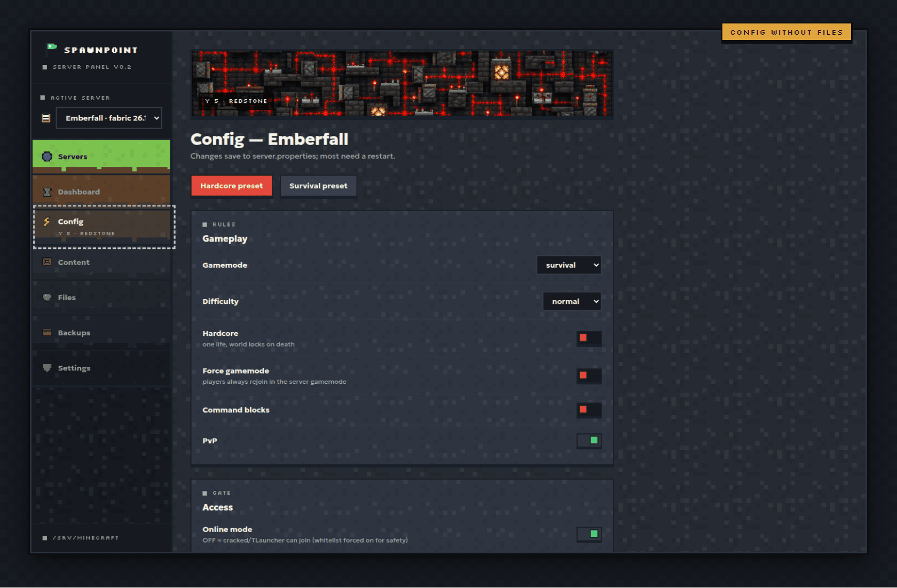
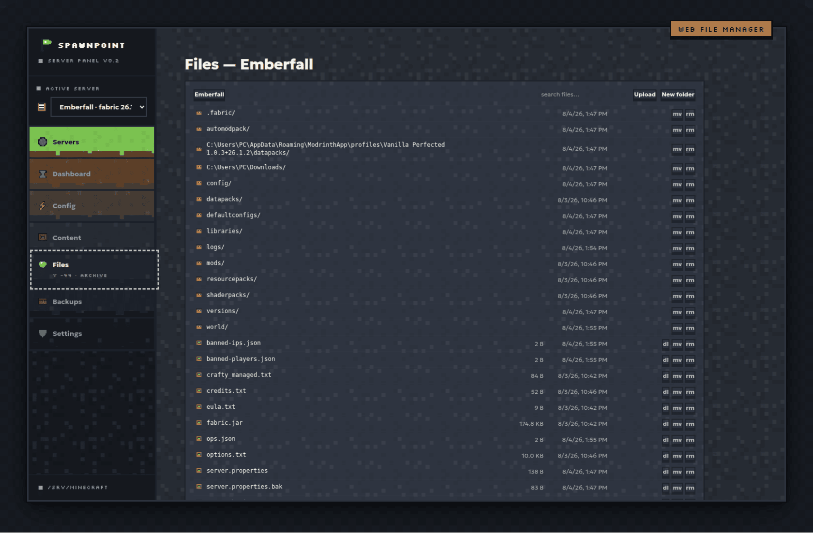

# Spawnpoint

**The self-hosted Minecraft control panel where a broken pack can never reach your friends.**



Spawnpoint is a web panel you run on the machine that hosts your Minecraft
servers. It fronts [Crafty Controller](https://craftycontrol.com/) (which owns
the server processes) and adds everything around it: one-click mod/plugin
installs from Modrinth + CurseForge, a config UI, Realms-style world slots,
backups — and a **verification pipeline** no other panel has:

1. **Dry-boot preflight** — every mod install is boot-tested in a sandbox
   before it counts. Missing dependencies are detected from the loader's own
   error output and installed automatically; a mod that still can't boot is
   rolled back, not left to crash the next restart.
2. **Headless client boot test** — the pack is launched in a real headless
   Minecraft client, so client-side crashes are caught server-side.
3. **Multiplayer join gate** — a throwaway clone of your server is booted and
   a real client actually joins it. If the join would kick your friends, you
   find out first.
4. **Join-kick self-heal** — when a gate identifies the offending mod, it is
   quarantined, the pack regenerates, and the gate re-runs. You get a notice,
   not a broken evening.

Optional extras: an in-game AI "chat genie" (bring your own Anthropic API
token) that executes natural-language wishes over RCON and is engineered to
never claim success it can't verify, AutoModpack-based client sync so friends
never manage pack files, TPS monitoring, a web file manager, scheduled
restarts, and a storage cleaner.

## Screenshots

| | |
|---|---|
|  |  |
|  |  |

## Requirements

- Node.js 22+
- [Crafty Controller](https://craftycontrol.com/) managing your servers
- Any OS. On headless Linux the client/join gates run invisibly under `xvfb`;
  on macOS/Windows (or a Linux desktop) the verification client opens as a
  small window for a few minutes instead — same real client, same verdict.
  A box with no display at all skips those two gates with an honest
  "not verified" verdict; the server-side dry-boot always runs.

## Quick start

```bash
git clone https://github.com/vayungodara/spawnpoint
cd spawnpoint
npm ci
npm run build -w server && npm run build -w web
SPAWNPOINT_ROOT=/path/to/your/layout node server/dist/index.js
```

The panel listens on port **25570**. `SPAWNPOINT_ROOT` points at the directory
containing `Crafty/servers`, `Shared/`, and `Spawnpoint/` (see Layout below).
Put your Crafty API token in `Shared/crafty-token.txt`.

## Architecture

The full system design — the four verification gates, their invariants, the
genie, client sync — is documented in [ARCHITECTURE.md](ARCHITECTURE.md).

## Layout

- `server/` — Fastify + TypeScript API; serves the built web app on :25570
- `web/` — Vite + React + Tailwind frontend (pixel-art design system)
- `data/` — all runtime state and secrets (settings, ledgers, session secret).
  **Never committed.**

## Configuration (`data/settings.json`)

Created on first run. Notable optional fields:

- `pinHash` — set a PIN from the Settings page to gate remote access
  (localhost always bypasses; sessions are HMAC-signed cookies)
- `curseforgeApiKey` — enables the CurseForge half of the content browser
- `vercelToken` + `laneDomain`/`laneSrvTarget`/`laneRelayIp`/`laneBoxIp` —
  optional "public lane" provisioning: each server automatically gets a
  `<name>.<your-domain>` address via a relay droplet + Vercel DNS SRV
  records. Leave unset and servers are LAN/Tailscale-only.
- `modrinthContact` — contact string appended to the Modrinth User-Agent

## Development

```bash
npm run dev:server   # API on :25570
npm run dev:web      # Vite dev server, proxies /api
```

## Security notes

- Designed to sit behind Tailscale or a LAN — do not expose the panel port to
  the open internet.
- Remote access is PIN-gated (hashed at rest, per-IP lockout, signed session
  cookies). The genie has a `commandPolicy` setting: `no-admin` blocks
  op/whitelist/ban-class commands for installs where wish access isn't fully
  trusted.
